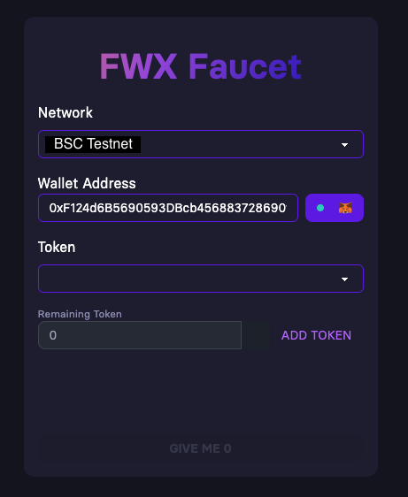

# Faucet App Assignment

## Overview

This project involves the creation of a website that interfaces with a multi-token smart contract on the Binance Smart Chain (BSC) testnet. The objective is to enable users to select and request tokens from the faucet direcly to their wallets.

## Technical Requirements

The website must be developed using React JS and TypeScript.
Any development frameworks that complement React JS are permissible.
The application should offer a straightforward and efficient user interface for interacting with the multi-token faucet.

### Key Features

Token Selection and Faucet Functionality

The website must allow users to select from multiple tokens available in the faucet and **<ins>request the selected tokens to be sent to their wallets.</ins>**

**Additional Features**

Chain and Token Addition:
A feature to easily add the BSC testnet to users' wallets if not already configured.
A feature to add selected tokens to users' wallets for easier tracking.
Responsive Design: The website should be fully responsive, ensuring a seamless user experience across both desktop and mobile devices.
Containerization: Provision of a Docker image for the application to facilitate easy deployment and testing.

**Bonus points will be awarded for**

- Implementing an intuitive and visually appealing UI/UX design.
- Optimizing blockchain interactions for cost-efficiency and speed.
Comprehensive documentation on setup, usage, and website interaction.
- Clean, readbale code that follows best practices in software development.

## Submission

Submit your project by publishing the code repository on GitHub. The repository should be accessible to the examiners, either publicly or through shared access. Upon completion, email the link to the repository to narawit@fwx.finance.

The repository must include:
- The complete source code.
- A README file with detailed setup instructions and how to use the Docker image.
Any additional documentation or comments within the code to elucidate your approach and methodologies.

## Resources Provided
- Website Design example
  
  

- Application Binary Interface (ABI) of the Multi-Token Faucet Smart Contract ( ABI Directory )
- Address of the Multi-Token Faucet Smart Contract ( addresses.ts )
- Addresses of the Token Contracts ( addresses.ts )

We are eager to see your creative solutions and how you tackle the complexities of interacting with a multi-token faucet. For questions or further clarification, please contact us at <narawit@fwx.finance>.

